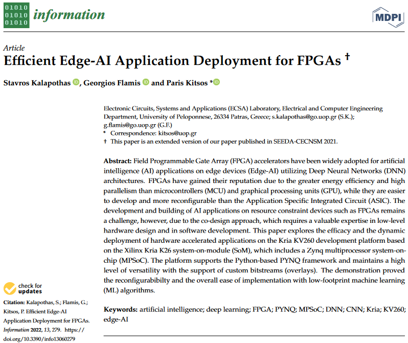

# Efficient-Edge-AI-Application-Deployment-for-FPGAs
This repo is a placeholder for the extended paper belonging to MDPI Special Issue [Design Automation, Computer Engineering, Computer Networks and Social Media (SEEDA-CECNSM 2021)](https://www.mdpi.com/journal/information/special_issues/SEEDA_CECNSM_2021) and featured in the [Information, Volume 13, Issue 6 (June 2022)](https://www.mdpi.com/2078-2489/13/6). [MDPI Open Access](https://www.mdpi.com/2078-2489/13/6/279).

# Citation
If you use this work in academic research, please, cite it using the following BibTeX:
> Kalapothas, S.; Flamis, G.; Kitsos, P. Efficient Edge-AI Application Deployment for FPGAs. Information 2022, 13, 279. https://doi.org/10.3390/info13060279
```
@Article{info13060279,
AUTHOR = {Kalapothas, Stavros and Flamis, Georgios and Kitsos, Paris},
TITLE = {Efficient Edge-AI Application Deployment for FPGAs},
JOURNAL = {Information},
VOLUME = {13},
YEAR = {2022},
NUMBER = {6},
ARTICLE-NUMBER = {279},
URL = {https://www.mdpi.com/2078-2489/13/6/279},
ISSN = {2078-2489},
ABSTRACT = {Field Programmable Gate Array (FPGA) accelerators have been widely adopted for artificial intelligence (AI) applications on edge devices (Edge-AI) utilizing Deep Neural Networks (DNN) architectures. FPGAs have gained their reputation due to the greater energy efficiency and high parallelism than microcontrollers (MCU) and graphical processing units (GPU), while they are easier to develop and more reconfigurable than the Application Specific Integrated Circuit (ASIC). The development and building of AI applications on resource constraint devices such as FPGAs remains a challenge, however, due to the co-design approach, which requires a valuable expertise in low-level hardware design and in software development. This paper explores the efficacy and the dynamic deployment of hardware accelerated applications on the Kria KV260 development platform based on the Xilinx Kria K26 system-on-module (SoM), which includes a Zynq multiprocessor system-on-chip (MPSoC). The platform supports the Python-based PYNQ framework and maintains a high level of versatility with the support of custom bitstreams (overlays). The demonstration proved the reconfigurabibilty and the overall ease of implementation with low-footprint machine learning (ML) algorithms.},
DOI = {10.3390/info13060279}
}
```




## Tools used for experimental setup:

### Hardware
* [Xilinx Kria KV260 Vision AI Starter Kit]()
* [Pcam 5C 5MP Color Camera Sensor Module with MIPI CSI-2 interface](https://digilent.com/reference/add-ons/pcam-5c/start)
* [Logitech Brio 4K Ultra HD USB Webcam with HDR](https://www.logitech.com/en-us/products/webcams/brio-4k-hdr-webcam.960-001105.html)
* [Getting Started with Kria KV260 Vision AI Starter Kit](https://www.xilinx.com/products/som/kria/kv260-vision-starter-kit/kv260-getting-started/getting-started.html)

### Software
* [Ubuntu Certified image (20.04 LTS) for Xilinx Kria KV260 Vision AI Starter Kit](https://ubuntu.com/certified/202104-28895)
* [PYNQ DPU overlay (Vitis AI DPU 1.4.0)](https://github.com/Xilinx/DPU-PYNQ)
* [Tensorflow ML framework](https://tensorflow.org)
* [Python 3.8](https://www.python.org/downloads/)
* [Jupyter Notebooks](https://jupyter.org/)
* [OpenCV](https://opencv.org/)
* [NumPy](https://numpy.org/)
* [Pybind11](https://github.com/pybind/pybind11)
* [Platform Assets Container](https://xilinx-wiki.atlassian.net/wiki/spaces/A/pages/2057043969/Snaps+-+xlnx-config+Snap+for+Certified+Ubuntu+on+Xilinx+Devices#Platform-Assets-Container)
* [platformstats - A library that provides APIs to print different platform statistics](https://github.com/Xilinx/platformstats)
* [Keras Framework](https://keras.io/)
* [Caffe framework](https://caffe.berkeleyvision.org/)

### Model
* [Vitis AI Model Zoo](https://github.com/Xilinx/Vitis-AI/tree/v1.4/models/AI-Model-Zoo)
* [LeNet-5](http://yann.lecun.com/exdb/lenet/index.html)
* [ResNet50](https://keras.io/api/applications/resnet/#resnet50-function)
* [Depthwise Seperable Convolutional Neural Network (DS-CNN)](https://paperswithcode.com/paper/hello-edge-keyword-spotting-on)
* [Xilinx MultiTask Model](https://docs.xilinx.com/r/en-US/ug1354-xilinx-ai-sdk/MultiTask)
* [vpgnet_pruned_0_99 for lane detection based on VPGnet](https://xilinx-wiki.atlassian.net/wiki/spaces/A/pages/2068283453/Snaps+-+xlnx-vai-lib-samples+Snap+for+Certified+Ubuntu+on+Xilinx+Devices#samples)
* [yolov3 yolov3_adas_pruned_0_9A based on YOLOv3 and DarkNet for ADAS](https://xilinx-wiki.atlassian.net/wiki/spaces/A/pages/2068283453/Snaps+-+xlnx-vai-lib-samples+Snap+for+Certified+Ubuntu+on+Xilinx+Devices#%5BinlineExtension%5DAvailable-Sample-Applications-and-Models)
* [vgg_19_tf is based on VGG for object detection](https://xilinx-wiki.atlassian.net/wiki/spaces/A/pages/2068283453/Snaps+-+xlnx-vai-lib-samples+Snap+for+Certified+Ubuntu+on+Xilinx+Devices#%5BinlineExtension%5DAvailable-Sample-Applications-and-Models)

### Dataset
* [The MNIST Database of Handwritten Digit Images for Machine Learning Research](http://yann.lecun.com/exdb/mnist/)
* [The CIFAR-10 Dataset](https://www.cs.toronto.edu/~kriz/cifar.html)
* [Google Speech Commands Dataset](https://ai.googleblog.com/2017/08/launching-speech-commands-dataset.html)
* [A Diverse Driving Dataset for Heterogeneous Multitask Learning](https://www.bdd100k.com/)
* [Caltech Lanes Dataset](http://www.mohamedaly.info/datasets/caltech-lanes)
* [Cityscapes Dataset](https://www.cityscapes-dataset.com/)
* [ImageNet Dataset](https://www.image-net.org/download.php)
* [Car License Plate Detection](https://www.kaggle.com/datasets/andrewmvd/car-plate-detection)

